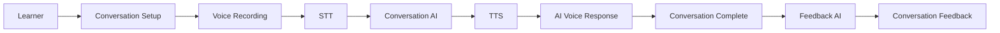
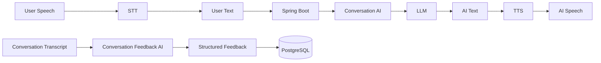
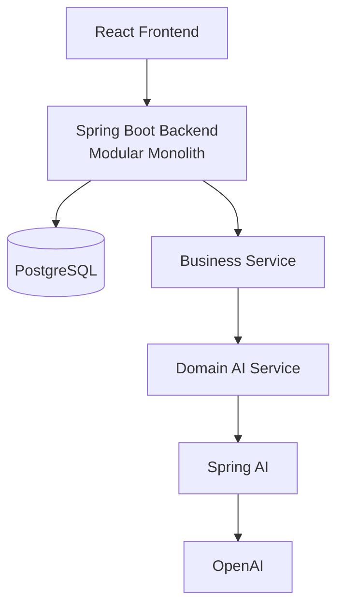

# AI Japanese Speaking

AI와 실제 일본어 음성 대화를 나누고, 학습이 끝난 뒤 표현 중심의 피드백을 받는 Speaking 학습 서비스입니다.

## 프로젝트 소개

이 서비스는 텍스트 문제 풀이보다 실제 발화 경험에 초점을 둡니다. 학습자는 상황과 난이도를 설정한 뒤 음성으로 일본어를 말하고, AI와 대화를 이어가며 학습을 마친 후 대화 전체를 바탕으로 한 피드백을 받습니다.

`상황 설정 → 음성 발화 → AI 일본어 대화 → 학습 종료 → AI Feedback`

### 일반 회화

일상적인 상황에서 AI Persona와 일본어로 대화하며 자연스러운 표현을 연습하는 모드입니다. 상황, 대화 상대의 역할·성격, 난이도, 자막 설정을 바탕으로 대화를 구성하며, 학습 종료 후 자연스러움·문법·어휘·상황 적합성 및 더 자연스러운 대체 표현을 피드백으로 제공합니다. 일반 회화 피드백은 숫자 점수 없이 텍스트 중심으로 제공됩니다.

### 면접 회화

일본어 면접 상황을 연습하기 위한 확장 방향입니다. 일본어 표현뿐 아니라 답변 구조, 논리, 질문 적합성, 구체성, 전달력, Business Japanese를 평가하고, 답변 맥락을 바탕으로 Follow-up Question을 생성하는 흐름으로 설계되어 있습니다.

## 주요 기능

### 일반 회화

- 상황과 AI Persona 기반의 일본어 대화
- 초급·중급·고급 난이도 및 자막 설정
- 음성 녹음과 STT 기반 사용자 발화 인식
- AI 일본어 응답과 TTS 기반 음성 출력
- 학습 종료 후 Conversation Feedback 생성
- 자연스러움·문법·어휘 피드백과 자연스러운 대체 표현 제안

### 면접 회화

설계된 면접 회화 기능은 다음을 포함합니다.

- 일본어 면접 질문과 사용자 음성 답변
- 일본어 표현 및 답변 내용 평가
- 답변 기반 Follow-up Question
- 답변별 평가와 최종 Interview Feedback

## 사용자 역할

### Learner

일본어 일반 회화와 면접 학습을 수행하고, 자신의 학습 기록과 피드백을 확인하는 사용자입니다.

### Manager

같은 기관에 소속된 학습자의 승인·상태를 관리하고 기관 이용 현황을 확인하는 역할입니다.

### Admin

플랫폼 운영자로서 기관, Manager 승인·상태, 서비스 전체 이용 현황을 관리하는 역할입니다.

## 서비스 Flow

일반 회화의 기본 학습 흐름입니다.



## AI Processing Flow

음성 처리와 대화 생성, 피드백 생성을 분리합니다. 피드백은 학습 완료 후 전체 Transcript를 기준으로 생성됩니다.



## System Architecture

하나의 Spring Boot 애플리케이션 안에서 도메인 경계를 유지하는 Modular Monolith 구조입니다. 별도의 Python AI Server나 MSA 분리 없이, AI 통신은 Spring AI 계층을 통해 Backend 내부에서 관리합니다.



## Tech Stack

| 영역 | 기술 | 역할 |
| --- | --- | --- |
| Frontend | React | 학습 화면과 사용자 경험 제공 |
| Backend | Java 21, Spring Boot, Spring MVC | REST API와 비즈니스 로직 처리 |
| Security | Spring Security, JWT | 인증과 역할 기반 접근 제어 |
| Data | Spring Data JPA, PostgreSQL | 도메인 데이터 저장 및 조회 |
| AI | Spring AI, OpenAI | LLM·Speech-to-Text·Text-to-Speech 연동 |

## Backend Architecture

Backend는 Domain-first 패키지 구조를 기반으로 구성합니다. 각 도메인은 필요한 책임을 함께 두고, 요청은 기본적으로 다음 계층을 거칩니다.

`Controller → Service → Repository → PostgreSQL`

- **Controller**: HTTP Request/Response 처리와 요청 형식 검증
- **Service**: 비즈니스 로직, Transaction, 도메인 권한 검증
- **Repository**: Spring Data JPA 기반 Database 접근

AI 호출은 Controller가 직접 수행하지 않습니다. `Business Service → Domain AI Service → Common AI Client → Spring AI → OpenAI` 경계를 두어 Conversation과 Interview의 AI 책임을 분리합니다.

## Project Structure

```text
ai-japanese-speaking/
├── frontend/
├── backend/
├── docs/
│   ├── architecture.md
│   ├── backend-rules.md
│   ├── ai-design.md
│   ├── ai-japanese-speaking-erd-api-spec.md
│   └── ai-japanese-speaking-openapi.yml
├── AGENTS.md
└── README.md
```

## Database

ERD를 기준으로 일반 회화와 면접의 공통 학습 단위를 `Speaking Session`으로 관리하고, 모드별 설정·발화·피드백을 분리합니다.

- **Organization / User**: 기관, 사용자 계정, 역할과 승인 상태 관리
- **Speaking Session**: 일반 회화와 면접 학습의 공통 소유자·유형·진행 상태·이용 시간 관리
- **Conversation**: 일반 회화 설정, 사용자·AI 발화 Transcript, 표현 중심 Feedback 및 교정 관리
- **Interview**: 면접 설정, 질문·답변, 답변별 평가, 전체 Feedback 관리
- **Feedback**: 일반 회화는 무점수 표현 피드백을, 면접은 평가 기준에 따른 답변·종합 피드백을 저장

History는 별도 테이블을 만들지 않고 기존 세션, 설정, 발화, 피드백 데이터를 조회·조합해 제공합니다.

## API

API는 OpenAPI-first 원칙으로 관리합니다. 현재 설계된 API 영역은 다음과 같습니다.

- Auth / User / Organization
- Speaking / Conversation / Interview
- History
- Manager / Admin

상세 endpoint, 요청·응답 schema, 상태 값은 [OpenAPI 명세](docs/ai-japanese-speaking-openapi.yml)를 참고하세요.

## Security

- Spring Security와 JWT 기반 인증을 사용합니다.
- 비밀번호는 `PasswordEncoder`로 해시하여 저장합니다.
- 현재 사용자는 JWT와 SecurityContext를 기준으로 식별하며, 클라이언트가 전달한 `userId`를 인증 근거로 사용하지 않습니다.
- OpenAI API Key는 Backend에서만 사용하고, Frontend에 전달하지 않습니다.
- JWT Secret, API Key, Database Password 등 Secret은 소스 코드에 하드코딩하지 않고 환경 설정 또는 환경변수로 주입합니다.

## AI 설계 원칙

### Conversation AI와 Feedback AI 책임 분리

Conversation AI는 사용자의 발화에 자연스럽게 일본어로 응답해 대화를 이어갑니다. Feedback AI는 학습 완료 후 전체 Transcript를 평가해 학습 결과를 생성합니다.

### Turn마다 평가하지 않음

일반 회화 중에는 매 Turn마다 문법이나 자연스러움 평가를 생성하지 않습니다. 정상 종료 시 전체 대화를 기준으로 최대 한 번의 Feedback 생성만 수행하며, 이후 Feedback 조회는 저장된 데이터를 사용합니다.

### Structured Feedback

일반 회화 Feedback은 요약, 자연스러움·문법·어휘 코멘트, 강점, 다음 학습 팁, 교정 표현처럼 구조화된 결과로 저장·활용할 수 있도록 설계합니다.

### Speech 역할 분리

- **STT**: Speech → Text
- **LLM**: Text → AI Response
- **TTS**: AI Response → Speech

AI Provider API Key는 Backend에서만 관리하며 브라우저에 노출하지 않습니다.

## Getting Started

현재 E2E 구현이 진행 중입니다. 실행 환경과 환경변수 구성은 MVP 통합 완료 후 업데이트할 예정입니다.

### Backend

E2E 구현 완료 후 실행 방법 업데이트 예정

### Frontend

E2E 구현 완료 후 실행 방법 업데이트 예정

### Environment Variables

실제 구성 확인 후 업데이트 예정입니다. `OPENAI_API_KEY`는 환경변수에서만 읽으며, Secret의 실제 값은 저장하지 않습니다.

## Documents

| 문서 | 역할 |
| --- | --- |
| [architecture.md](docs/architecture.md) | 전체 시스템 구조와 Backend·AI Architecture 결정 |
| [backend-rules.md](docs/backend-rules.md) | Spring Boot 구현 규칙 |
| [ai-design.md](docs/ai-design.md) | AI, STT/TTS, Feedback 설계 원칙 |
| [ai-japanese-speaking-erd-api-spec.md](docs/ai-japanese-speaking-erd-api-spec.md) | Database ERD와 API 설계 기준 |
| [ai-japanese-speaking-openapi.yml](docs/ai-japanese-speaking-openapi.yml) | API Contract |

## Current Status

현재 MVP 개발 진행 중입니다. 우선 일반 회화의 음성 기반 E2E 흐름을 검증하는 방향으로 개발하고 있으며, 면접 AI, Manager/Admin 기능, 고도화된 AI 기능은 설계 범위와 확장 방향을 기준으로 순차적으로 다룹니다.

실제 구현 상태는 MVP 통합 후 업데이트할 예정이며, 이 문서는 진행 중인 기능을 완료된 것으로 단정하지 않습니다.

## Future Improvements

- Interview AI 고도화와 Follow-up 정책 개선
- Adaptive Difficulty 및 개인별 약점 기반 Personalized Feedback
- Conversation Context 요약·관리 개선
- Streaming STT, Streaming TTS, 실시간 Conversation
- AI Usage Monitoring과 Token/Cost Monitoring
- Async AI Processing, Queue, Retry / Recovery
